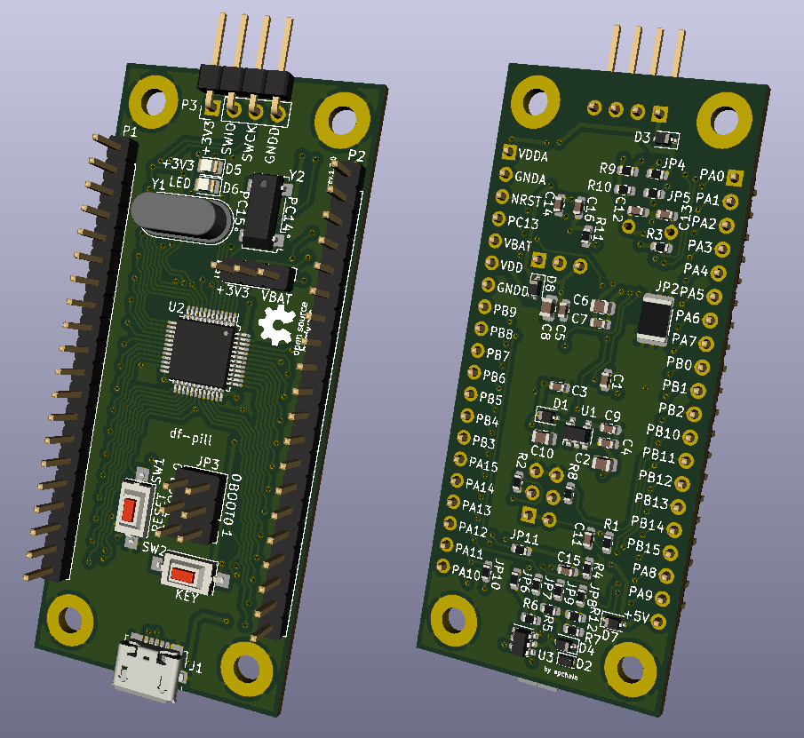

# df-pill

This project was extracted from another, complex device project which originally
targeted cheap STM32F103C8T6 board known as "bluepill" as main board.
However, it soon became apparent that bluepill has shortcomings with USB
interface, which was meant to be primary communication channel.

**tl;dr** bluepill cannot work with USB while being externally powered.
It is designed to be powered with USB host only.
Some bluepill boards have hardware bugs.

To overcome problems this board was designed.
It has a number of enhancements and was thought to be maximally generic.

**Enhancements:**

1. Improved USB
  > USB now has optional ESD protection, implements VBUS sense with software
  > and is fully detachable via jumpers.

2. Every pin has external connection
  > NOTE: some pins like PC14, PC15, BOOT0 don't have terminals at the board
  > sides, but still have them at crystal mount points and boot pin headers.

3. Separate analog terminals VDDA and GNDA and separate analog ground
  > NOTE: It is required to provide VDDA and GNDA or simply join them
  > with VDD and GNDD. GNDA and GNDD may be joined on board with jumper.
  > VDD and VDDA may be joined via terminals.

4. Detachable add-ons
  > On-board LEDs and keys can be detached with jumpers.

5. VDD and +5V inputs are protected power inputs.
  > All power supply nets are now protected with Schottky diodes.

The goal of this project is to learn electronics while creating a useful device,
for everyone. So keep in mind that this device isn't designed by professional.

It is assumed that user is able to perform all necessary tasks related to
device creation, which are not covered with project files. User must also
perform all necessary precautions on every such task. See [LICENSE](LICENSE).

This means things like electrical safety, soldering, parts ordering and
PCB manufacturing are out of the scope. As a note, if you think you can
buy bluepill, disassemble it and apply its parts to this board, then
you're right. Bluepill has core parts, but some other uncommon ones need
to be ordered.

# How to use

Install Kicad EDA and open project file: `device/df-pill/df-pill.pro`.
Original project was made with *Kicad EDA 5.1.5-3*

You don't need any library installed, because project is fully autonomous.
It has all symbols, footprints and 3D models in `device/df-pill/lib` dir.

If you like to change anything it is recommended to first add new items
to library and then use them in project to maintain autonomous project
structure.

If you'd like to have multiple boards on a single copper plate
read `device/panelization.md`.

# Versioning

Schematic and and PCB have different, but related version formats.

- Schematic: **X.Y**
- PCB: **X.Y.Z**

Where **X** = major version, **Y** = minor version, **Z** = patch.

Schematic major version increment breaks external interface.
Minor version increment changes components, but external interface
is the same. Any schematic version change breaks PCB layout.

PCB's major and minor versions are from schematic versions.
Patches are PCB modifications/optimizations that are fully
compatible with current schematic.

# References

A number of resources was used in this project.
See [reference.md](reference.md) for list.

# License

This project is licensed under [The Unlicense](LICENSE).
It contains library files from KiCAD EDA library in `device/lib`.
These files are licensed under [KiCAD EDA Libraries License](https://kicad-pcb.org/libraries/license/)
